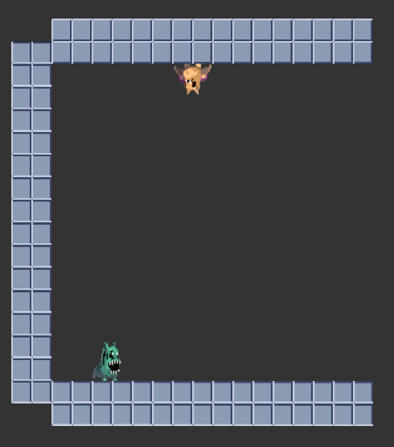
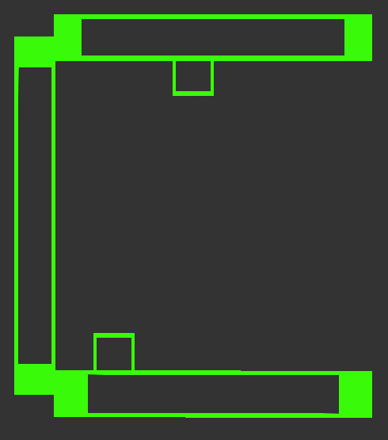
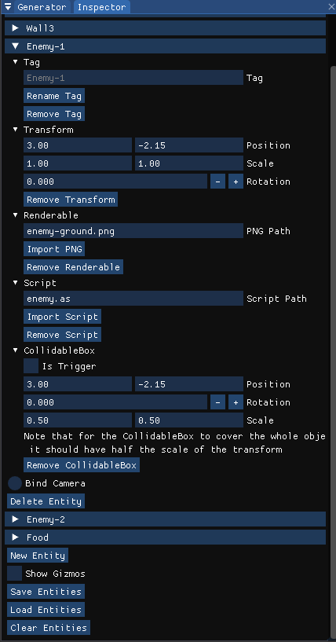
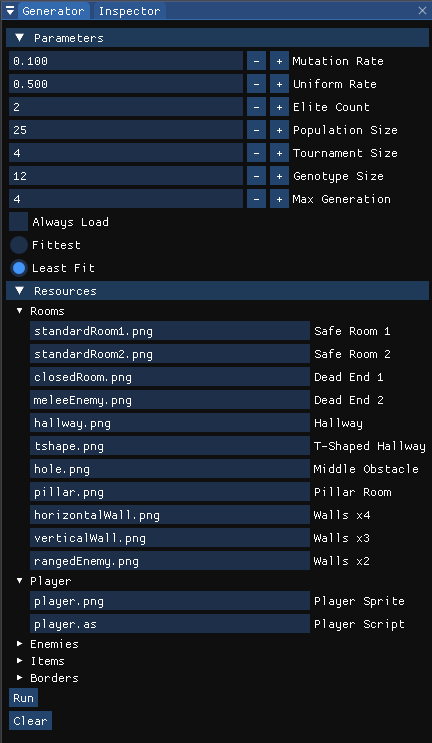

# Ivy Game Engine
Ivy is a C++ 2D Game Engine primarily focused on developing Roguelike games.   Currently Windows x64 is the only supported platform.  
Features:
* Custom Entity-Component-System (ECS) 
* Event System 
* Scripting System 
* OBB Collision Detection
* OpenGL Rendering
* Procedural Environment Generation 
* Immediat Mode GUI. 

# Setup

Clone the repository using <code>git clone --recursive</code> to fetch all the required submodules.
Run the <code>ProjectGenerator.bat</code> batch file to generate a Visual Studio 2017 project. Make sure to set <code>IvyApplication</code> as the startup project.

Project files for Visual Studio 2017 are generated using <a href="https://github.com/premake/premake-core">Premake5</a>. If you wish to use a different IDE make sure to check these files and update them accordingly.  (Note: The AngelScript module has a number of readily available project files at <code>IvyEngine\vendor\angelscript\projects</code>).

An Application on top of the engine is required to define a class that derives from <code>Ivy::Application</code> and a class that derives from <code>Ivy::SortingLayer</code>. An additional function that returns the newly created <code>Ivy::Application</code> instance is also required.  An example application is provided in the <code>IvyApplication</code> project.

# Implementation Details
### Logging

The engine uses <a href="https://github.com/gabime/spdlog">Spdlog</a> to log internal operations through the use of <code>IVY_CORE_[LEVEL]</code> macros while application operations are logged using <code>IVY_[LEVEL]</code> macros. The logger settings are available in <code>IvyEngine/Core/Logger.h</code>.

### Events & Input Handling

The Event System functions according to the Observer Pattern, where Events act as subjects and EventHandlers which encapsulate a callback function subscribe to them. The callback is executed in response to the Event. Currently the engine does not provide a separate phase of Event resolution so Events are handled the moment that they occur.

Input Handling & Window Manipulation for Windows are performed through the <a href="https://github.com/glfw/glfw">GLFW3</a> library. The source code is available in the Windows package.

### Rendering

The renderer uses OpenGL as the primary graphics API with <a href="https://github.com/Dav1dde/glad">GLAD<a/> as the function loader. Currently it is the only supported graphics API.  The engine implements Contexts, Index Buffers, Vertex Buffers, Vertex Arrays, Shaders & Textures.   Commands are issued to the Renderer through the use of RenderCommands. The engine also provides a single Orthographic Camera which can be manipulated by the CameraSystem accessed through the GUI.  
Additional functionality is added to the renderer by the <a href="https://github.com/nothings/stb">Stb</a> and <a href="https://github.com/g-truc/glm">GLM</a> libraries.
  

  
  

### GameObject System

The game object system follows the ECS paradigm and provides a number of readily available Systems and Components.  
Systems:
* CameraSystem
* ScriptSystem
* RenderSystem
* CollisionSystem
* CollidableGizmoSystem

Components:
* Collidable (Oriented Bounding Box)
* Renderable
* ScriptComponent
* Tag
* Transform

Components are aggregated in packed-arrays to maximize cache performance.  
Additional Components and Systems can be added by the user as long as they derive from the Component and System class respectively. We provide the <code>UserComponent</code> as an example for user-defined components.  Note that in order to be able to import/export newly defined components the appropriate functions have to be implemented and registered with the <code>JSONManager</code>.  (We recommend taking a look at the <a href="https://github.com/nlohmann/json"> json-nlojmann library </a> for more information).

The GUI is implemented using <a href="https://github.com/ocornut/imgui">Dear ImGui</a>. It provides easy access to creating, deleting and modifying entities and components.

### Scripting

  
Game-specific code can be written in C++ or in <a href="https://www.angelcode.com/angelscript">AngelScript</a> scripts. A number of sample scripts are present in <code>IvyApplication/scripts</code>. Currently the types the script engine is registered with are the following: 
* Vec2 
* Transform
* Renderable
* Collidable
* ScriptableObject

The ScriptComponent mentioned above merely encapsluates a ScriptableObject such that it can be managed by the ECS.  
To create a new script it suffices to create a new <code>.as</code> file and place it in the scripts folder. Script classes should <code>#include 'common.as'</code> and provide a constructor. The <code>onUpdate</code> and <code>onMessage</code> methods can be implement to specify behavior.

### Procedural Content Generation

The PCG module is responsible for level generation and uses the Feasible-Infeasible Two-Populations Genetic Algorithm. An Individual is a collection of DesignElements (DEs) where each DE should specify a Tag, a Transform and an associated Entity. The FI2Pop class encapsulates the algorithm which can be tweaked through the Generator GUI. 

Note: The LevelGenerator class is responsible for actually instantiating the game objects and should be implemented per project.

# Hopefully Eventually Upcoming Features
* Sound System
* Animation System
* Multi-threading
* More Gizmos
* Collidable Types
* Support for multiple components of the same type per Entity
* Layered Rendering
* Multiple Graphics API Support

